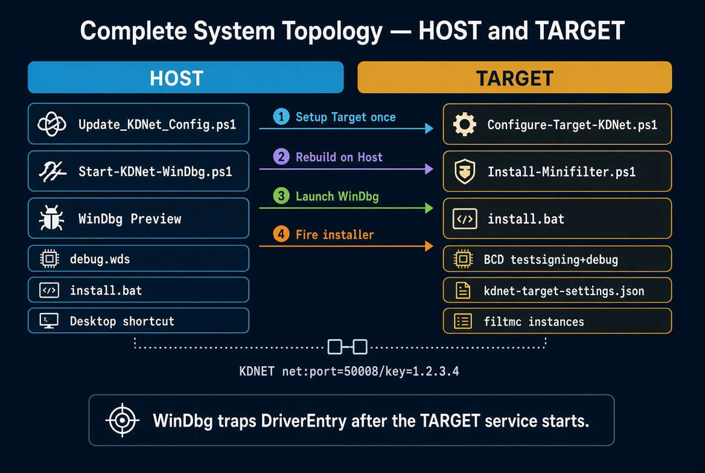
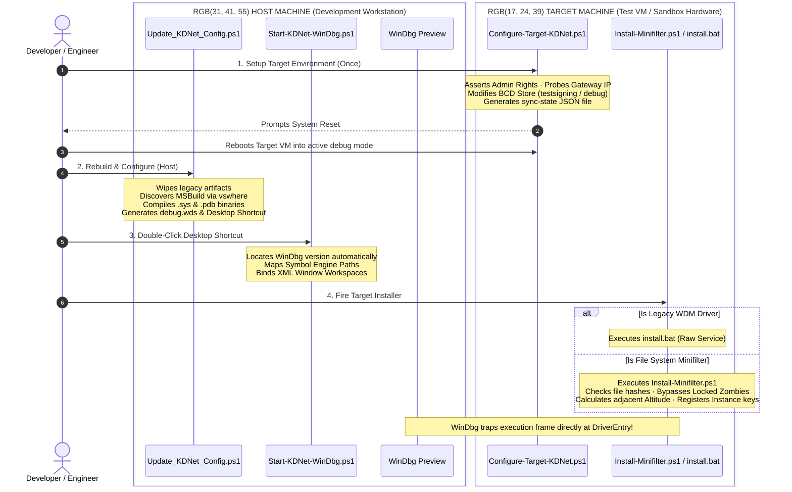
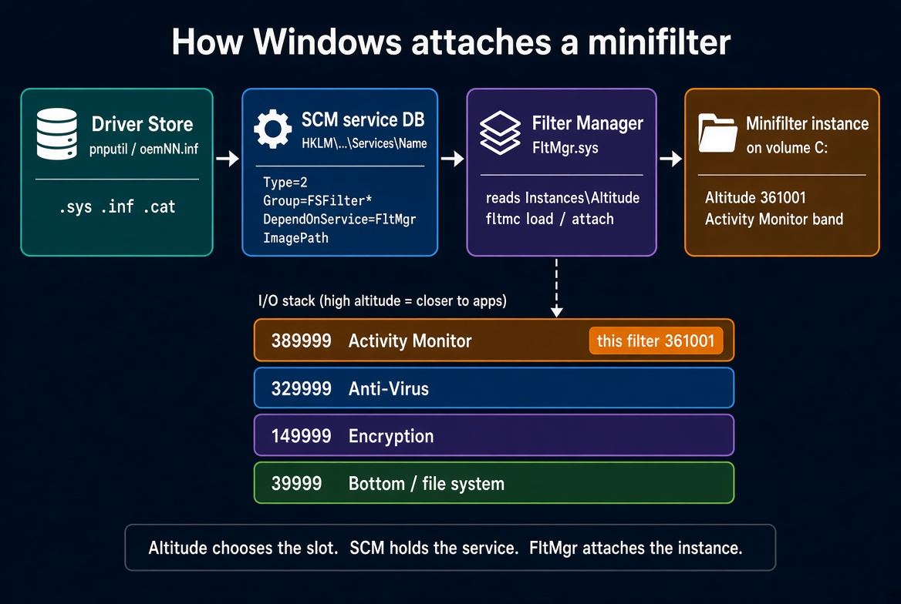
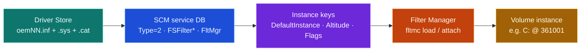
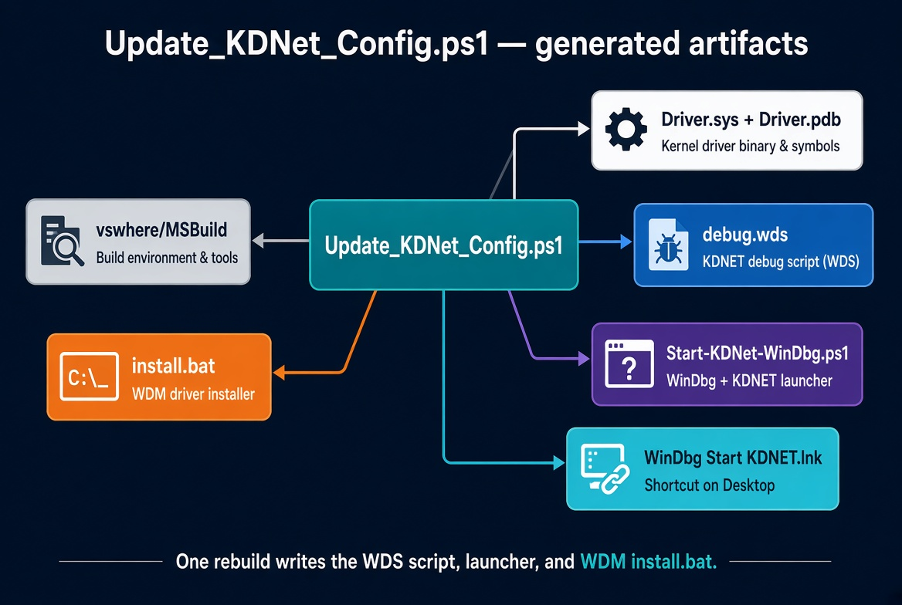
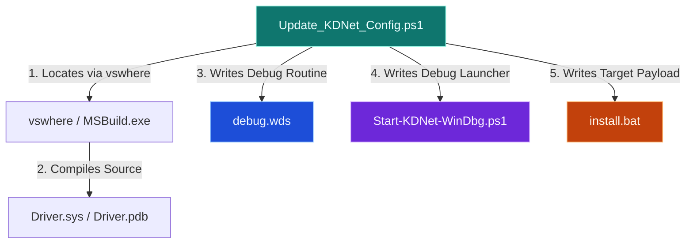
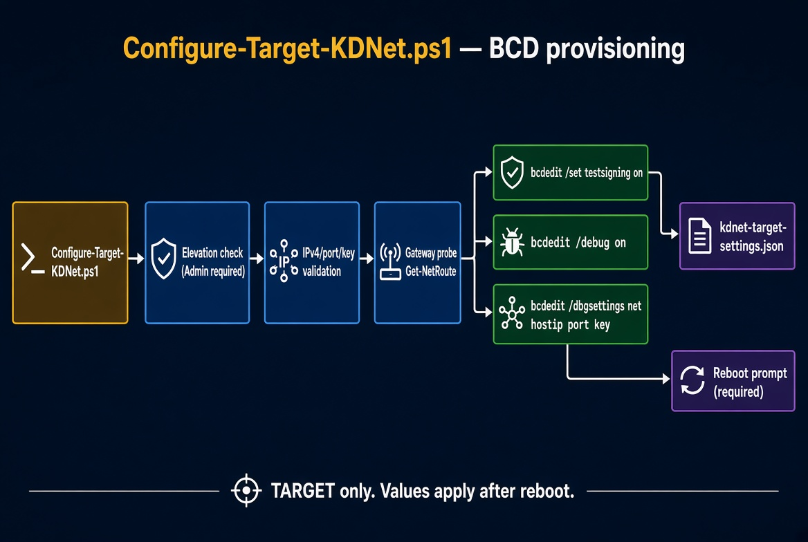
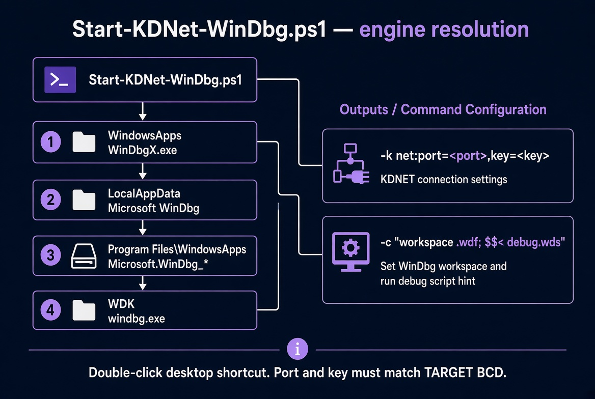
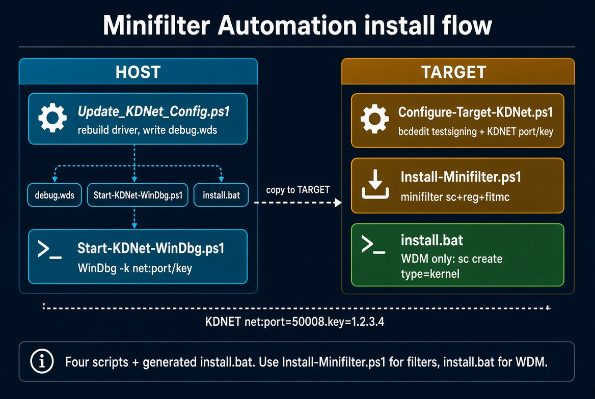

# Automated Windows Kernel Driver Lab Framework

A resilient, end-to-end automation suite for building, deploying, and debugging Windows Kernel-Mode drivers (**WDM** & **File System Minifilters**) over a network using **KDNET** and **WinDbg Preview**.

This framework eliminates the tedious manual orchestration typically required for kernel development, such as manual BCD registry manipulations, locked driver files ("zombie states"), and manual workspace layout restoration.

---

## Complete System Topology





---

## Architectural File Breakdown

### 1. Target Machine Provisioning

* **`Configure-Target-KDNet.ps1`**: Run this **once** on the target test machine to unlock code integrity validation frameworks, turn on global debugging modes, and bind your host network routing profiles.
* **`Install-Minifilter.ps1`**: The primary deployment engine for Minifilters. Features cryptographic hash analysis, automated service state breakdowns via `sc.exe`, dynamic filter altitude balancing, and interactive recovery overrides (Driver Verifier / Kernel Crash Dump generation).

### 2. Host Machine Orchestration

* **`Update_KDNet_Config.ps1`**: The primary compilation orchestrator. It uses `vswhere.exe` to find Visual Studio build assets, strips out dirty artifacts, runs multi-threaded compilations, and exports optimized launcher payloads.
* **`Start-KDNet-WinDbg.ps1`**: A resilient WinDbg boot application. It abstracts system search paths to find the debugger binary, maps active symbols, and streams immediate automation commands to standard input on handshake detection.

### 3. Generated Downstream Artifacts

* **`install.bat`**: An autogenerated legacy WDM installer payload used on targets when building standard non-filter kernel services.
* **`debug.wds`**: A specialized WinDbg script file. It forces verbose symbol tracing, aligns public PDB resources, and sets up execution barriers targeting your driver's `DriverEntry` vector without crashing structural I/O networks.

---

## How the SCM Store, Driver Store, Minifilters, and Altitudes Relate

Windows never attaches a minifilter driver simply because a `.sys` file exists on disk. For an **instance** to safely attach to a volume at a specific **altitude**, three distinct system configurations must be in alignment.



### Architectural Mapping

| Component Store | Target Asset / Configuration | Write / Registry Tool |
| :--- | :--- | :--- |
| **Driver Store** | Published deployment package (`oemNN.inf`, `.sys`, `.cat`). *Optional during local lab testing.* | `pnputil` or SetupAPI |
| **SCM Service Database** | `HKLM\SYSTEM\CurrentControlSet\Services\<name>`<br>• Configures `Type=2` (File System), `Group=FSFilter*`, and `DependOnService=FltMgr`. | `sc.exe create` or INF `AddService` |
| **Instance Keys** | `Services\<name>\Instances\...`<br>• Assigns the target `Altitude` and operational `Flags`. | `reg.exe add` or INF `AddReg` *(Not handled by `sc create`)* |
| **Filter Manager** | The active kernel attach list. | `sc.exe start` or `fltmc load` |

### The Altitude Layer
An altitude acts as a deterministic slot on the file system I/O stack; higher numbers sit closer to user-mode applications. For example, Activity Monitor filters reside in the **360000–389999** range. Because no two filters can share an identical altitude, **Unique-Mode** reloads increment the altitude by 100. This design allows a freshly built driver instance to safely attach right next to a locked zombie instance without collision.

A minifilter is a multi-layered ecosystem, not merely a file in `System32`. While `Install-Minifilter.ps1` strips out conflicting `oemNN.inf` packages from the Driver Store, a formal store package isn't strictly required to execute code in a development lab. The core engine relies entirely on the SCM record, instance keys, and the Filter Manager matching up perfectly.



---
## Install-Minifilter.ps1 — TARGET deployment engine

### 1. Pre-Deployment Cleanup & Logging

- **Environment checks:** Reads `bcdedit` for `testsigning Yes` and looks for WDK `Inf2Cat` / `SignTool`. Unsigned lab drivers will not load if test signing is off. Missing WDK tools only block catalog signing, not the rest of the install.
- **Verifier pause:** `Disable-DriverVerifierForDriver` queries `verifier /querysettings` and resets Verifier on this `.sys` (and globally if other flags are set, which matters next to KDNET / `kdnic`). Extra Verifier references are a common reason the old image will not unlock.
- **`Clean-PreviousVersions` & `Rename-InfWithTimestamp`:** Enumerates Driver Store `oemNN.inf` packages that match the driver name, optionally deletes them with `pnputil /delete-driver /uninstall /force`, then renames the INF to `DriverName_yyyyMMddHHmmss.inf`. That stops Windows from silently serving yesterday's package.
- **`Get-WinEvent`:** Pulls the last System-log events related to "Verifier" or the driver name. Immediate visibility into recent crashes, driver loads, or Driver Verifier violations without opening Event Viewer by hand.

### 2. Zombie Driver Detection

- **`Test-DriverFileMatch`:** SHA-256 of the new `.sys` versus `C:\Windows\System32\drivers\DriverName.sys`. Same hash means this binary is already on disk.
- **`Test-ZombieLock`:** Exclusive open of the dest `.sys`, rename-and-rename-back, and Verifier load/unload counts.
- **`Get-DriverVerifierLoadStatus`:** Checks if Driver Verifier is actively monitoring the driver and compares how many times it has been loaded versus unloaded.
- **`if ($verifStatus.LoadCount -gt ($verifStatus.UnloadCount + 1))`:** If the driver has been loaded more times than it has successfully unloaded, the script flags it as a **Zombie**. A zombie driver occurs when a driver's unload routine hangs or references are leaked, meaning the operating system cannot fully remove it from kernel memory. `sc stop` can look successful while the file in `System32\drivers` stays locked.

### 3. Dynamic Bypass (Unique Mode)

```powershell
if ($forceUniqueMode -or $zombieDetected) { ... }
```

Triggered when you passed `-ForceRename`, a zombie lock was detected, or you asked to reinstall a service that is still **Running**.

Instead of overwriting the stuck driver, the script generates a brand new, unique service name (`DriverName_VHHmmss`), a unique `.sys` destination (`C:\Windows\System32\drivers\DriverName_HHmmss.sys`), a unique binary path (`\??\` + that file), and the next altitude in the same FSFilter band (`Get-NextAltitude`, typically +100).

This allows you to load new code changes immediately under a temporary identity without rebooting.

### 4. Service Overwriting & File Replacement

- **`Get-Service` ... `sc.exe delete`:** Attempts a clean breakdown of the original driver service by forcing it to stop and deleting it with `sc.exe`. Short sleeps give the Service Control Manager time to release handles.
- **`Replace-DriverFile`:** If unique mode is not forced, tries to overwrite the binary in `C:\Windows\System32\drivers`. If that copy fails because the file is locked, it marks a zombie and triggers the unique-path fallback.
- **Fallback `Copy-Item`:** After a late zombie, it changes the filename, path, and service name, then retries the copy. `-ForceRename` bypasses the original file entirely and writes directly to the unique location.

### 5. Registering the Minifilter Service

Filter Manager does **not** create services. `fltmc load` only loads a service that already exists. Creation is SCM (or an INF). This script uses SCM, then writes the instance keys FltMgr reads.

**A. `sc.exe create`** registers the driver service. Crucially it sets a dependency on Filter Manager (`depend= FltMgr`), marks it as a file system driver (`type= filesys`), and sets it to load on demand (`start= demand`).

```powershell
sc.exe create $finalServiceName `
    binPath= "$finalBinPath" `
    type= filesys `
    start= demand `
    error= normal `
    depend= FltMgr `
    DisplayName= "$DriverName Minifilter" `
    group= "$loadOrderGroup"
```

| Value | Meaning |
|---|---|
| `type= filesys` (`Type = 2`) | File-system driver. Required for a minifilter. |
| `depend= FltMgr` | Must start after Filter Manager. |
| `start= demand` | Do not auto-start a first load that may be broken. |
| `group=` | FSFilter load-order group from the INF (for example `FSFilter Activity Monitor`). |
| `binPath=` | `\??\C:\Windows\System32\drivers\<file>.sys` so the kernel can open the image. |

That is enough for SCM. It is **not** enough for Filter Manager to attach an instance.

**B. `reg add ... \Instances`** writes the keys that tell Filter Manager where to attach in the storage stack: default instance name, flags, and the calculated **Altitude** (the number that determines the order in which file systems see I/O).

```powershell
reg add "HKLM\SYSTEM\CurrentControlSet\Services\$finalServiceName\Instances" `
    /v DefaultInstance /t REG_SZ /d "$finalServiceName Instance" /f

reg add "HKLM\SYSTEM\CurrentControlSet\Services\$finalServiceName\Instances\$finalServiceName Instance" `
    /v Altitude /t REG_SZ /d $finalAltitude /f

reg add "HKLM\SYSTEM\CurrentControlSet\Services\$finalServiceName\Instances\$finalServiceName Instance" `
    /v Flags /t REG_DWORD /d 0x0 /f
```

| Key | Why |
|---|---|
| `Instances\DefaultInstance` | Which instance subkey FltMgr uses. |
| `...\Instance\Altitude` | Stack position (for example `361001` in Activity Monitor 360000-389999). |
| `...\Instance\Flags` | `0` = no special instance flags. |

Example tree after A + B:

```text
HKLM\SYSTEM\CurrentControlSet\Services\FsMonDrv
    Type, Start, ErrorControl, ImagePath, DisplayName, Group, DependOnService
    Instances\
        DefaultInstance = "FsMonDrv Instance"
        FsMonDrv Instance\
            Altitude = "361001"
            Flags    = 0
```

`sc create` does **not** write those four instance values. Missing them is why many "the service is running" installs never show up in `fltmc`.

### 6. Verification & Validation (`fltmc`)

- **`sc.exe start`:** Boots the driver (`fltmc load` is equivalent once the keys exist).
- **`fltmc instances` & `fltmc filters`:** Native Filter Manager commands to check whether the driver attached to file-system volumes. The script parses those lists with a regex for the driver name.
- If instances are visible, it sets `start= auto`.

### 7. Automatic Diagnostics & Environmental Self-Healing

If the driver starts but no instances are active (failed to attach or crashed silently), the script acts as an interactive assistant:

- **Driver Verifier setup:** Offers `verifier /reset` then `verifier /standard /driver DriverName.sys` to catch hidden memory leaks or illegal pointer dereferences on the next load.
- **Crash dump configuration:** Checks `HKLM\SYSTEM\CurrentControlSet\Control\CrashControl`. If kernel minidumps are disabled, offers to set `CrashDumpEnabled = 3` (and keep 10 dumps) so a bugcheck leaves a file you can open in WinDbg.
- **Smart reboot:** Offers `Restart-Computer` when a locked file, pending Verifier change, or new dump setting needs a boot.

Then Verifier is optionally put back on this `.sys` only (`ReEnable-DriverVerifierIfNeeded`).

---

## Why This Script is Helpful

- **Eliminates the reboot loop during development.** Ordinarily, when a kernel driver gets stuck or hits an unload leak, you reboot the test machine to free the file lock and service name. This script bypasses that bottleneck by generating a brand-new service, filename, and altitude on the fly.
- **Zero-downtime hot-reloading for minifilters.** A one-line fix that refuses to unload no longer costs a full reboot. Suffix the service name, increment the altitude, test the next build on the live system.
- **Automates state diagnostics.** Instead of opening `verifier.exe` or Event Viewer after every failed deploy, the script prints why a driver failed to load or unload.
- **Handles aggressive cleanup.** `sc.exe delete` plus baked-in sleeps gives SCM time to release handles before the next write.
- **Automates tedious registry tasks.** Setting minifilter instances by hand means memorizing exact paths and flag types. The script writes `DefaultInstance`, `Altitude`, and `Flags` for you.
- **Sets up the debugging environment.** Optional Verifier and small minidumps mean the next failure can produce a dump instead of a silent attach miss.

---

## FltMgr vs `sc` + registry (what to use when)

`fltmc` cannot create the service. Microsoft's documented product path is an INF (`AddService` + `AddReg`) and then `fltmc load`. This script's full path writes the **same** keys by hand so a lab machine can reload without a Driver Store transaction.

| Goal | Better option |
|---|---|
| Product / clean first install / Win11 24H2 `Parameters\Instances` | INF + `pnputil /add-driver` + `fltmc load` |
| Everyday reload, registry already valid | `fltmc load` only (this script's **quick path**) |
| Locked `.sys`, running service, unique name + altitude+100 | `sc create` + `reg add` (this script's **full path**) |
| WHQL / attestation / other people's machines | Official INF + catalog, not raw `sc`/`reg` |

**Use `sc` + manual registry when** you own the TARGET and the INF path gets in the way: rebuild loops, zombie files, incomplete INF, no `oemNN.inf` leftovers, KDNET lab with test signing.

**Do not use it** as the ship vehicle. INF is the contract other people install.

On Windows 11 24H2+, Microsoft's MiniSpy sample stores instances under `Parameters\Instances`. This script writes the classic `Services\<name>\Instances` path used on Windows 10 lab machines.

---

## Quick path vs full path

Before it reaches `sc create`, the script tries cheaper exits:

- Service stopped, same hash, not locked → `Start-Service` + `fltmc instances`.
- Registry already looks like a minifilter (`Type=2`, `FSFilter*` group, depend `FltMgr`, `Instances` + altitude) → `fltmc load`.
- Service running → asks before reinstall; yes forces unique mode.

| | Quick (`fltmc load`) | Full (`sc create` + `reg add`) |
|---|---|---|
| When | Keys already valid, no zombie | First install, broken keys, locked file, or explicit reinstall |
| Who creates the service | Already exists | This script |
| Who loads the filter | FltMgr | `sc start`, then FltMgr attach |
| Altitude | Unchanged | Bumped in unique mode |

---

## Update_KDNet_Config.ps1 — HOST build orchestrator

This PowerShell script (`Update_KDNet_Config.ps1`) acts as an automated build and environment orchestrator for kernel-mode debugging. It ties together local project rebuilding, KDNET network debugging configurations, automated WinDbg launcher creation, and automated deployment script generation.



### What the script is doing

**1. Input validation & sanity checking**

- **Parameters audit:** Verifies debugger network connection strings (`-Port`, `-Key`) and target meta (`-DriverName`). Port must be an integer between 1 and 65535.
- **Workspace detection:** Uses `Get-ChildItem` to scan the script directory for a Visual Studio solution (`*.sln`). If missing, it throws a terminal error.

**2. Environmental pre-cleaning & compilation**

- **Artifact purging:** Removes legacy `\x64` and ephemeral `\.vs` so the rebuild is deterministic.
- **MSBuild resolution:** Calls `vswhere.exe` from the Visual Studio Installer directory to locate `MSBuild.exe`.
- **Target build:** `Rebuild` on x64 using `$BuildConfig` (`/t:Rebuild /m /nologo`).

**3. File discovery**

Locates the generated `.sys`, derives the `.pdb` name, and sets strings used by `debug.wds` and `install.bat`.

**4. Downstream asset generation**

| File | Encoding | Role |
|---|---|---|
| `debug.wds` | UTF-8 **without BOM** (`UTF8Encoding($false)`) | `!sym noisy`, symbol path, `.reload`, **only** `bp Module!DriverEntry` |
| `Start-KDNet-WinDbg.ps1` | PowerShell | Host launcher with baked `-k net:port,key` |
| `install.bat` | ASCII | TARGET WDM `sc create type= kernel` + copy `.sys`/`.pdb` |
| `WinDbg Start KDNET.lnk` | COM shortcut | Desktop double-click entry to the launcher |

`DispatchDeviceControl` and `EnumerateProcesses` breakpoints are not written.



UTF-8 without BOM keeps `kd.exe` / WinDbg from treating a BOM as a command. ASCII `install.bat` keeps `cmd.exe` from choking on UTF-16 nulls. The launcher here-string bakes `$Port` / `$Key` and a `-c` startup block for the `.wdf` workspace. `WScript.Shell` writes the desktop shortcut with `-ExecutionPolicy Bypass`.

Console output reminds you that `install.bat` is **WDM** (`type= kernel`). Minifilters must use `Install-Minifilter.ps1` instead.

```powershell
.\Update_KDNet_Config.ps1
.\Update_KDNet_Config.ps1 -Port 50008 -Key 1.2.3.4 -DriverName InspectorDrv
.\Update_KDNet_Config.ps1 -Port 50009 -Key a.b.c.d -DriverName FsMonDrv -BuildConfig Debug
```

| Parameter | Default | Meaning |
|---|---|---|
| `-Port` | `50008` | Embedded into the generated launcher |
| `-Key` | `1.2.3.4` | Embedded into the generated launcher |
| `-DriverName` | `InspectorDrv` | Service name inside `install.bat` |
| `-SymbolModule` | `.sys` basename | Module used in `bp Module!DriverEntry` |
| `-BuildConfig` | `Debug` | MSBuild configuration |
| `-WorkspacePath` | `C:\Development\Damian\Drivers\WinDbgWorkspace.xml` | Optional `.wdf` workspace |

---

## Configure-Target-KDNet.ps1 — TARGET BCD provisioner

This script is a dedicated target-side environmental provisioner for KDNET. Run it **only on the TARGET** (test VM). It writes Boot Configuration Data so the machine can handshake with WinDbg on the HOST.



### What the script is doing

**1. Hardened validation**

- Elevation audit (`Test-IsAdministrator`). BCD writes fail without admin.
- Network constraint testing (`Test-IPv4Address`, `Test-KdnetPort`, `Test-KdnetKey`) before anything is saved.

**2. BCD query tokenizer**

`Get-BcdeditOutput` / `Parse-BcdeditKeyValues` run `bcdedit /dbgsettings` and `bcdedit /enum {current}`, strip preamble lines, and map `testsigning`, `debug`, `hostip`, `port`, `key`.

**3. Host IP discovery**

If `-HostIp` is omitted, the script uses `Get-NetRoute -DestinationPrefix "0.0.0.0/0"`, sorts by `RouteMetric`, and takes the default gateway. On Hyper-V / VMware host-only networks that gateway is usually the HOST running WinDbg.

**4. Boot provisioning**

Unless `-SkipTestSigning`:

```text
bcdedit /set testsigning on
bcdedit /debug on
bcdedit /dbgsettings net hostip:<HostIp> port:<Port> key:<Key>
```

**5. Sync sidecar**

Writes `kdnet-target-settings.json` with port, key, and driver name so HOST automation can stay aligned.

After writing, it re-reads BCD and prints a report. If live `port`/`key` still differ from the requested values, that is **queued BCD** — it applies on the next boot, not a script failure. Unless `-NoRebootPrompt`, it offers `Restart-Computer -Force`.

```powershell
.\Configure-Target-KDNet.ps1 -HostIp 192.168.1.10
.\Configure-Target-KDNet.ps1 -HostIp 192.168.1.10 -Port 50008 -Key 1.2.3.4 -DriverName InspectorDrv
.\Configure-Target-KDNet.ps1 -ShowOnly
```

| Parameter | Default | Meaning |
|---|---|---|
| `-HostIp` | gateway probe | IPv4 of the WinDbg HOST |
| `-Port` | `50008` | KDNET TCP port |
| `-Key` | `1.2.3.4` | Shared KDNET key |
| `-DriverName` | `InspectorDrv` | Recorded in sidecar JSON |
| `-ShowOnly` | off | Print BCD, do not write |
| `-SkipTestSigning` | off | Write dbgsettings only |
| `-NoRebootPrompt` | off | Skip reboot question |

**Output**

```text
  port             : 50008
  key              : 1.2.3.4
  Host WinDbg listen string:
    -k net:port=50008,key=1.2.3.4
```

---

## Start-KDNet-WinDbg.ps1 — HOST debugger launcher

This script is the host-side debugger engine launcher (checked in here, and also regenerated by `Update_KDNet_Config.ps1`). Run it on the developer workstation.



### What the script is doing

**1. Engine resolution fallback**

1. `%LOCALAPPDATA%\Microsoft\WindowsApps\WinDbgX.exe` (Store alias)
2. `%LOCALAPPDATA%\Microsoft\WinDbg\WinDbgX.exe`
3. `C:\Program Files\WindowsApps\Microsoft.WinDbg_*`
4. WDK `Windows Kits\10\Debuggers\x64\windbg.exe`

**2. Relative paths**

`$PSScriptRoot` is used for `debug.wds` when `-WdsPath` is omitted. Default symbols: `srv*C:\Symbols*https://msdl.microsoft.com/download/symbols`.

**3. Handshake macros**

Builds `-k net:port=<Port>,key=<Key>` and a `-c` block that loads the `.wdf` workspace and prints how to run `$< debug.wds`.

```powershell
.\Start-KDNet-WinDbg.ps1
.\Start-KDNet-WinDbg.ps1 -Port 50008 -Key 1.2.3.4 -DriverName InspectorDrv
.\Start-KDNet-WinDbg.ps1 -Port 50009 -Key a.b.c.d -WdsPath C:\dev\debug.wds
```

Port and key must match TARGET BCD from `Configure-Target-KDNet.ps1`.

---

## Step-by-Step Execution Guide



### Step 1: Provision the Target Test Environment

Copy `Configure-Target-KDNet.ps1` to the target system, open PowerShell **as Administrator**, and run:

```powershell
.\Configure-Target-KDNet.ps1 -HostIp 192.168.x.x -Port 50008 -Key 1.2.3.4
```

If `-HostIp` is left blank, the script parses the default gateway. **Allow the reboot.**

### Step 2: Initialize Configuration and Build on Host

```powershell
.\Update_KDNet_Config.ps1 -Port 50008 -Key 1.2.3.4 -DriverName MyDriverName -BuildConfig Debug
```

This triggers a clean rebuild and places `WinDbg Start KDNET.lnk` on the HOST desktop.

### Step 3: Armed Connection Listen Loop

Double-click **WinDbg Start KDNET**. Expected console:

```text
=== Launching WinDbg KDNET ===
Driver : MyDriverName
Listen : net:port=50008,key=1.2.3.4
WDS    : C:\Development\Project\debug.wds
Opened WinDbg Network Debugger Connection Engine...
```

### Step 4: Deploy and Load the Binary

Transfer compiled outputs and the installer to the TARGET. Run **as Administrator**:

* **Legacy WDM services:**

  ```cmd
  install.bat
  ```

* **File system minifilters:**

  ```powershell
  .\Install-Minifilter.ps1 -DriverName FsMonDrv -DriverPath C:\build\fsmon
  ```

If `Install-Minifilter.ps1` finds an old image frozen in kernel memory, it enters **Unique Mode**, increments altitude by 100, generates a fresh service name, and attaches without a reboot.

Do not run `Install-Minifilter.ps1` and `install.bat` for the same image.

### Step 5: Hook and Debug

When the service starts, WinDbg should break in `DriverEntry`:

```text
[BP] === DriverEntry ===
MyDriverName!DriverEntry:
fffff801`4a233000 48895c2408      mov     qword ptr [rsp+8],rbx
kd>
```

To refresh symbols and breakpoints later:

```text
$< debug.wds
```

---

## Environmental Self-Healing & Diagnostics

If attach fails, `Install-Minifilter.ps1` offers:

* **Driver Verifier:** `verifier /standard /driver` on the target `.sys` for pool / IRQL / bad-pointer bugs.
* **Crash dumps:** If minidumps are off, it can set `CrashControl\CrashDumpEnabled = 3` (keep 10 dumps) so a bugcheck leaves a `.dmp` for WinDbg.

---

## Requirements

- Windows 10 / 11 x64
- Elevated PowerShell on TARGET scripts and `install.bat`
- HOST: Visual Studio / MSBuild, WinDbg Preview, WDK to build the driver
- TARGET: `bcdedit`, `sc`, `fltmc`, `pnputil`, `verifier`; optional WDK `Inf2Cat` / `signtool`

Test signing and kernel debug are **not** a separate manual step. `Configure-Target-KDNet.ps1` already runs `bcdedit /set testsigning on` and `bcdedit /debug on`, then prompts for a reboot (unless you pass `-SkipTestSigning` or `-NoRebootPrompt`). Live BCD values apply after that reboot.

```powershell
.\Configure-Target-KDNet.ps1 -HostIp 192.168.x.x -Port 50008 -Key 1.2.3.4
```

---

## Mock tests

```bash
python3 mock_tests/test_minifilter_automation.py
```

Expected: `ALL TESTS PASSED` (40).

---

## References

- [Setting Up KDNET](https://learn.microsoft.com/en-us/windows-hardware/drivers/debugger/setting-up-a-network-debugging-connection)
- [The testsigning BCD option](https://learn.microsoft.com/en-us/windows-hardware/drivers/install/the-testsigning-boot-configuration-option)
- [Creating an INF File for a Minifilter Driver](https://learn.microsoft.com/en-us/windows-hardware/drivers/ifs/creating-an-inf-file-for-a-minifilter-driver)
- [Loading and Unloading a Minifilter](https://learn.microsoft.com/en-us/windows-hardware/drivers/ifs/loading-and-unloading)
- [Load order groups and altitudes](https://learn.microsoft.com/en-us/windows-hardware/drivers/ifs/load-order-groups-and-altitudes-for-minifilter-drivers)
- [fltmc](https://learn.microsoft.com/en-us/windows-hardware/drivers/devtest/fltmc)
- [pnputil](https://learn.microsoft.com/en-us/windows-hardware/drivers/devtest/pnputil)
- [Driver Verifier](https://learn.microsoft.com/en-us/windows-hardware/drivers/devtest/driver-verifier)
- [bp / bu / bm](https://learn.microsoft.com/en-us/windows-hardware/drivers/debuggercmds/bp--bu--bm--set-breakpoint-)

---

## Comparison

| File | Machine | Creates service? | Uses FltMgr? |
|---|---|---|---|
| `Configure-Target-KDNet.ps1` | TARGET | No | No — BCD / KDNET only |
| `Update_KDNet_Config.ps1` | HOST | No — generates `install.bat` | No |
| `Start-KDNet-WinDbg.ps1` | HOST | No | No — WinDbg listen |
| `Install-Minifilter.ps1` | TARGET | Yes, `type= filesys` + altitude | Yes (`fltmc`) |
| `install.bat` | TARGET | Yes, `type= kernel` | No |

| Topic | Raw `sc create type= kernel` | `Install-Minifilter.ps1` |
|---|---|---|
| Driver class | WDM kernel | Minifilter (`type= filesys`) |
| Instance / altitude keys | Not written | `reg add` after `sc create` |
| Proof of success | `sc query` Running | `fltmc instances` |
| Locked `.sys` | Copy fails | Unique name / path / altitude |
| Old Driver Store package | Ignored | Optional `pnputil` delete |
| Verifier / dumps / Event Log | Manual | Offered in-console |

| Topic | INF + `pnputil` | `sc` + `reg add` | `fltmc` only |
|---|---|---|---|
| Creates service | Yes (SetupAPI) | Yes (SCM) | No |
| Writes altitude | Yes (`AddReg`) | Yes (`reg add`) | No (except one-off `attach -a`) |
| Driver Store package | Yes | No | No |
| Best for | Products, first install | Lab reload, locks | Attach after keys exist |
